# danmu-core

> 抖音直播的弹幕和礼物抓取

**示例:**


## 详情

### websocket

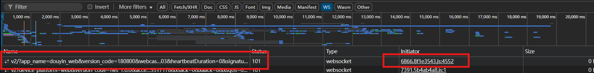
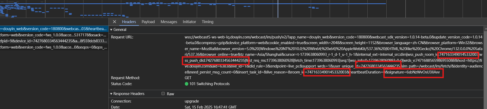
该wss请求为直播页面各项数据的推送，Payload包含 直播弹幕 礼物 直播间信息 礼物托盘 等数据,只需设置对应的room_id push_id 以及signature即可,
从initiator进入可以看到创建一个websocket client，`_getSocketParams()`构建socket连接参数
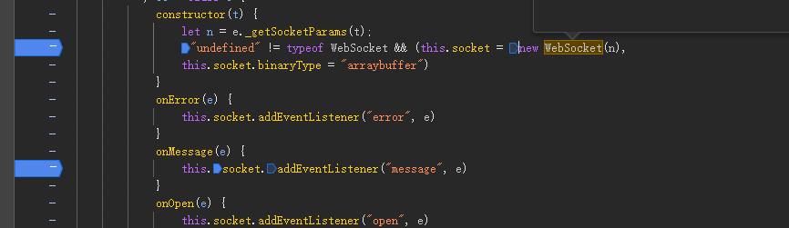
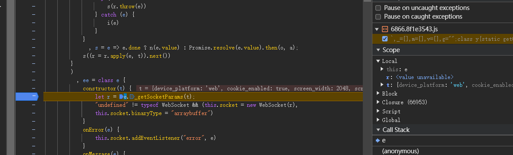
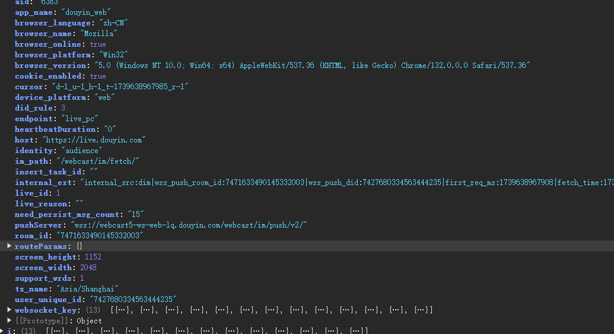

参考`biliup`项目的danmuka模块代码，可以看到该项目引用了一个webmssdk.es5.js的文件用来构建signature参数
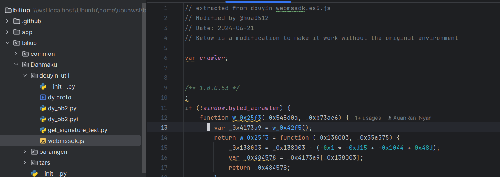
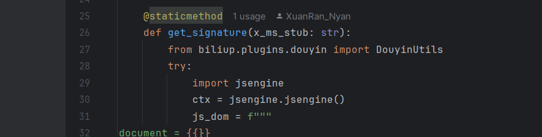
从`_getSocketParams()` debug进入，会看到调用`H()`方法用多个参数构建md5，md5传入`frontierSign()`进行构建signature，该函数来源自webmssdk.es5.js，本项目也参考这个方法，引入golang的js解释器，生成签名
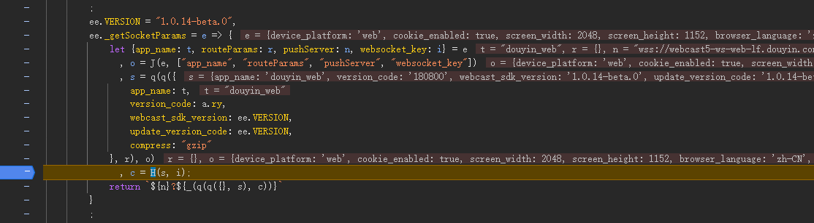
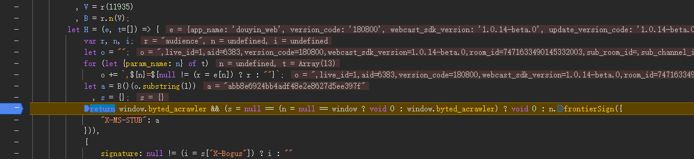
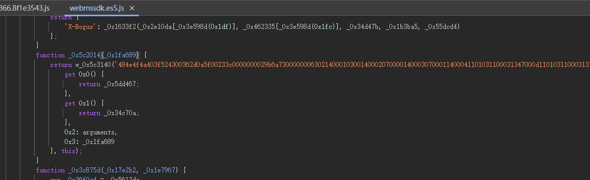
还能找到websocket client处理数据，发送Ack，发送心跳等方法。以及PushFrame携带的protobuf数据结构
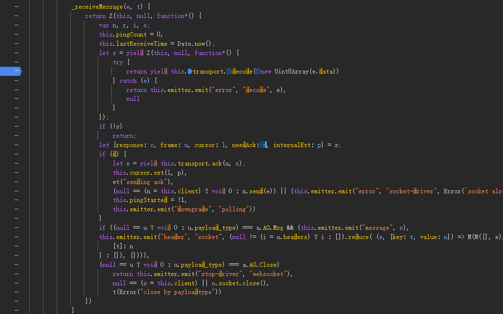
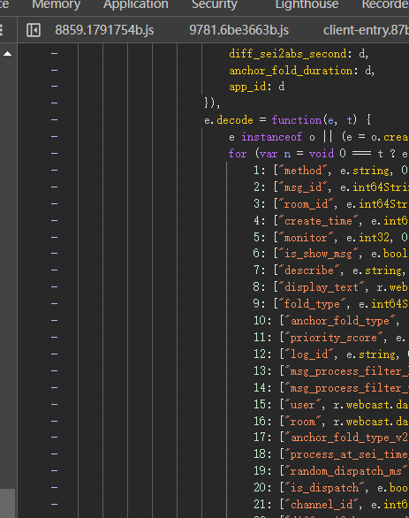
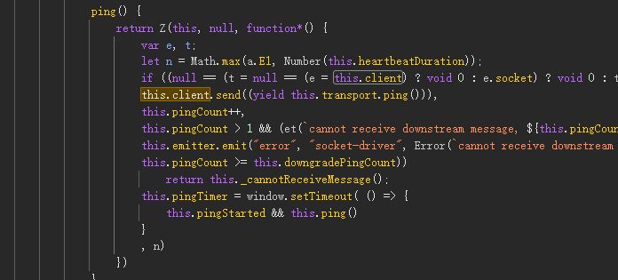


## 开始

###  项目使用条件

+ postgresql 用于数据存储
+ golang 环境

### 运行
#### danmu-core
1. 修改编写`/danmu-core/conf/app.ini`，配置数据库连接 (config参数可指定配置文件，默认从同目录conf/app.ini读取)
    ```ini
    [database]
    Type = "postgres" //目前只支持postgresql
    User = "postgres" //数据库user
    Password = "ppzxc"//数据库密码
    Host = "localhost"//数据库localhost
    Port = "5432"     //数据库端口
    DBName = "dy"     //数据库
    SearchPath = "live" //数据库schema
    
    [log] //日志相关
    LogSavePath = "./logs" 
    LogFileName = "app.log"
    MaxSize = 10        # 每个日志文件的最大尺寸，单位是 MB
    MaxBackups = 5      # 保留的旧文件最大数量
    MaxAge = 30         # 保留的旧文件最大天数
    Compress = true     # 是否压缩旧文件
    LogLevel = "debug"   # 日志级别: debug, info, warn, error
    TimeFormat = "2006-01-02 15:04:05"
    
    [rpc] //rpc端口，外部调用，danmu-http会调用该rpc
    Host = "0.0.0.0"
    Port = "50051"
    MaxIdleConns = 10
    MaxOpenConns = 100
    ConnectTimeout = 5  # seconds
    
    ```

2. 数据库运行`/danmu-core/cmd/sql/migrate.sql`,导入表结构

3. 若单独运行core执行监听任务的话需要向live-conf表中插入直播监听配置，, http ui core全部部署的话则直接在前端插入数据即可
    ```sql
        insert into live.live_confs ( room_display_id, url, name, enable)
        values (
                '直播间id',
                'https://live.douyin.com/{直播间id}',
                '任意名称',
                true
        );
    ```
4. 启动 `cmd/main/main.go` 

#### danmu-http

1. 修改编写`/danmu-http/conf/app.ini`，配置数据库连接 (config参数可指定配置文件，默认从同目录conf/app.ini读取)
    ```ini
    [app]          //项目端口
    Host = "localhost"
    Port = "8080"
    AdminEmail = admin@test.test         //初始admin账号     z
    AdminPassword = admin123                //初始admin密码
    
    [database]                             //后端数据库配置
    Type = "postgres"
    User = "postgres"
    Password = "ppzxc"
    Host = "localhost"
    Port = "5432"
    DBName = "dy"
    SearchPath = "live"
    MaxIdleConns = 5
    MaxOpenConns =10
    
    [log]
    LogSavePath = "./logs"
    LogFileName = "app.log"
    MaxSize = 10        # 每个日志文件的最大尺寸，单位是 MB
    MaxBackups = 5      # 保留的旧文件最大数量
    MaxAge = 30         # 保留的旧文件最大天数
    Compress = true     # 是否压缩旧文件
    LogLevel = "info"   # 日志级别: debug, info, warn, error
    TimeFormat = "2006-01-02 15:04:05"
    
    [rpc]  //danmu-core的rpc server配置
    ServerHost = "localhost"
    ServerPort = "50051"
    live_service_addr = localhost:50051
    
    [jwt]          //jwt token配置
    secret = your-secret-key
    expire_time = 24       //token过期时间
   ```
2. 运行`cmd/main/main.go`     

####  danmu-ui

1. 修改 `.env.development`文件
   ```
   NODE_ENV=development
   VITE_BASE_URL=http://localhost:8080      //danmu-http后端端口
   ```
2. 安装nodejs环境
3. 安装vite `npx vite`
4. danmu-ui目录下运行 `npm install` 安装依赖
5. danmu-ui目录下`vite` 启动项目dev环境


## todo list

### not yet:

- [ ] 数据库自动migrate
- [ ] 添加Makefile
- [ ] 添加dockerfile docker-compose.yml

### done:

- [x] vite vue3 创建前端页面，查看数据
- [x] gin gorm创建crud管理,实现弹幕礼物数据查看，以及权限登陆控制，grpc控制core监控任务
- [x] core grpc接口，控制 新建 更新 删除 直播监听协程
- [x] 周期性检测开播状态
- [x] 礼物数据落库
- [x] 弹幕数据落库
- [x] 送礼用户落库
